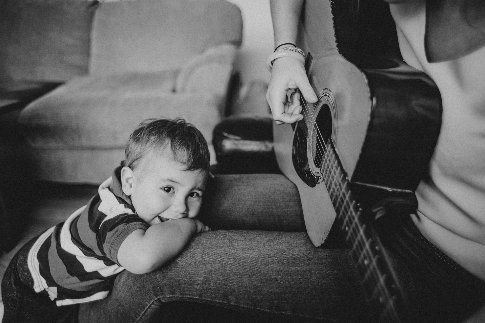

<!--  -->

I was at a restaurant the other day, watching a mother across the room, dancing, waving her hands in the air, pulling funny faces. All for the joy and delight of her baby, placed on top of the table in his rocker. The father came back from the bathroom and joined in the silliness. Two parents, putting on an impromptu show for an audience of one. But the baby wasn't the only one with a big grin on his face. The parents were smiling and laughing, revelling in the joy of their child. None of them having any care for the world around them. And most people, myself included, who were witness to this spectacle felt a little lighter at that moment.

Isn't it interesting that we give ourselves permission to act like fools when we're presented with a fresh-faced baby? For some people it's dogs. I look forward to, and sometimes cringe, at the thought of going for walks with my friend because she gets so excited, and expresses it, every time we pass a dog. And if it's a corgi? There are 10 minutes of squealing and petting I'll never get back.

If we're willing to give ourselves permission to break the status quo for a few moments when we're around a baby, what could life be like if we carried that permission slip around with us all day? There's a freedom in being silly and playful. We feel better for it. Thankfully babies don't care about our bullshit. Instead, they respond as if they've just witnessed another Big Bang - the entire world is born anew.

It doesn't take a lot to shift into that state. Imagine there's a baby in front of you. Your sole purpose, right now, is to tap into that playful part of you that's always there.

Go play.

Photo by: <a style="background-color:black;color:white;text-decoration:none;padding:4px 6px;font-family:-apple-system, BlinkMacSystemFont, &quot;San Francisco&quot;, &quot;Helvetica Neue&quot;, Helvetica, Ubuntu, Roboto, Noto, &quot;Segoe UI&quot;, Arial, sans-serif;font-size:12px;font-weight:bold;line-height:1.2;display:inline-block;border-radius:3px" href="https://unsplash.com/@tiomp?utm_medium=referral&amp;utm_campaign=photographer-credit&amp;utm_content=creditBadge" target="_blank" rel="noopener noreferrer" title="Download free do whatever you want high-resolution photos from Marcos Paulo Prado"><svg xmlns="http://www.w3.org/2000/svg" style="height:12px;width:auto;position:relative;vertical-align:middle;top:-2px;fill:white" viewBox="0 0 32 32"><title>unsplash-logo</title><path d="M10 9V0h12v9H10zm12 5h10v18H0V14h10v9h12v-9z"></path></svg>Marcos Paulo Prado</a>
